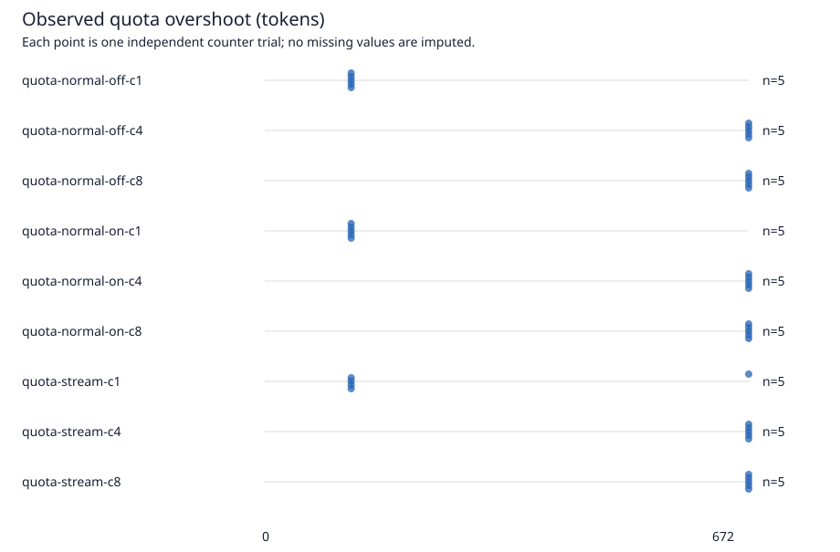

# Azure AI Gateway token limit experiments

[日本語](README.md)

This repository compares configured `llm-token-limit` quotas with actual model token usage on a single Azure API Management Developer gateway. It covers non-streaming responses with prompt estimation enabled or disabled, and streaming responses, at concurrency levels 1, 4 and 8.

Measured on October 1, 2026. With an 800-token quota, maximum observed provider usage was 1,472 tokens: an overshoot of 672 tokens, or 84% of the configured quota. The dedicated resource group has been deleted. The retail-price estimate is approximately JPY 77, not a confirmed invoice.

## Results

The environment was one APIM Developer classic unit in Japan East, using Regional Standard `gpt-4.1-mini`, version `2025-04-14`. See the [frozen protocol](experiments/protocol.json) and [run manifests](results/manifests.json).

| Mode | Concurrency | Median usage | Median overshoot | Maximum overshoot | Valid trials |
| --- | ---: | ---: | ---: | ---: | ---: |
| Non-streaming, estimation off | 1 | 920 | 120 | 120 | 5/5 |
| Non-streaming, estimation off | 4 | 1,472 | 672 | 672 | 5/5 |
| Non-streaming, estimation off | 8 | 1,472 | 672 | 672 | 5/5 |
| Non-streaming, estimation on | 1 | 920 | 120 | 120 | 5/5 |
| Non-streaming, estimation on | 4 | 1,472 | 672 | 672 | 5/5 |
| Non-streaming, estimation on | 8 | 1,472 | 672 | 672 | 5/5 |
| Streaming | 1 | 920 | 120 | 672 | 5/5 |
| Streaming | 4 | 1,472 | 672 | 672 | 5/5 |
| Streaming | 8 | 1,472 | 672 | 672 | 5/5 |

All quantities are tokens. Overshoot is `max(0, total provider usage in the trial - 800)`. A trial is the complete sequence under one isolated counter, including the first rejecting wave and a sequential post-limit probe.



All 45 quota, 18 control and 9 rate-limit trials were valid. The final matrix sent 795 requests: 537 HTTP 200 responses, 240 quota rejections with 403, and 18 rate-limit rejections with 429. There were no missing successful usage records or backend errors. The separate rate experiment used 1,200 tokens/minute; rejection `Retry-After` values were 46–48 seconds.

Every non-streaming response reported 56 input and 128 output tokens. Estimation on/off produced the same results under this prompt and quota; this does not establish that estimation is ineffective. Four sequential successes leave 64 tokens, enough to admit the next 56-token prompt but not its subsequent 128-token output.

Streaming provider usage was also 56 input plus 128 output tokens, while the `x-lab-consumed` response header was 56. That header arrives before the stream completes and must not be summed as final consumption. Sequential streaming usage across the five trials was `[1472, 920, 920, 920, 920]`. The response evidence does not identify the internal cause of the exceptional trial.

Concurrency 4 and 8 reached the same maximum. The runner waits for whole waves, rather than sustaining a continuously replenished load. These measurements do not establish linear scaling or production-tier bounds. Maximum within-wave start skew was 7 ms. The [timeline chart](results/quota-timeline.svg) shows the first concurrency-8 repetition of each mode.

## Recompute without Azure

```powershell
npm ci
npm test
npm run verify:results
```

The verifier uses only the published [request records](results/requests.jsonl), [trial summaries](results/trials.json) and [aggregate](results/summary.json). It recomputes token totals, overshoot, valid counts and SHA-256, failing on discrepancies. CI runs it on Windows and Linux. A [CSV export](results/trials.csv) is also available.

The [five pilot attempts](results/pilot-attempts.json) remain separate: three IP-filter failures, one 1,200-token attempt without room for its post-limit probe, and the successful 800-token pilot with 23 requests across five scenarios. None of these [56 pilot requests](results/pilot-requests.jsonl) enter the primary matrix.

## Publication boundary

Only reproduction code and sanitized evidence belong here. Article drafts, raw logs, Azure identifiers and credentials are stored outside the repository.

## Cost and cleanup

APIM Developer incurs charges while provisioned, even without requests. Model inference is charged separately. Check current prices and quota before deploying into a dedicated resource group, and delete only that group after exporting the evidence.

The [operations record](results/operations.json) covers approximately 4.97 hours from group creation through verified deletion. Rounding APIM to five hours gives JPY 51.83, plus JPY 25.08 for observed model usage including pilots: approximately JPY 76.91. Taxes, contract pricing and the final invoice are not confirmed. This was not a free Azure service.

```powershell
npm ci
npm run typecheck
npm test
az bicep build --file infra\main.bicep
```

Keep deployment parameters and raw logs outside this repository. CI does not deploy Azure resources or call paid models.

## Runner

Use Node.js 24, PowerShell 7 and Azure CLI. Set `$private` to a directory outside the repository, `$subscription` to the target subscription, and `$suffix` to an unused suffix.

```powershell
.\scripts\prepare-lab.ps1 -SubscriptionId $subscription -PrivateRoot $private -Suffix $suffix
.\scripts\deploy-lab.ps1 -PrivateRoot $private
```

Once deployment succeeds, export the client configuration to private storage. To update API policies without redeploying the APIM service, use `update-policies.ps1`.

With destination-dependent proxies, the IP lookup service and APIM can observe different source addresses. Supply `-AllowedIp` during preparation if the APIM-facing egress address is known. If `lab-ip-filter` rejects a call with 403, use APIM tracing to determine the source address, update `allowedIp` in the private parameters and redeploy the policies. Do not disable authentication or the IP restriction without authorization.

IP restriction is enabled by default. For this short-lived experiment only, the owner explicitly approved setting the private `restrictClientIp` parameter to `false`. Subscription-key authentication and managed-identity authentication to the model remain enabled. The run manifest records this exception.

```powershell
.\scripts\export-client-config.ps1 -PrivateRoot $private
npm run build
node dist\src\run.js $private pilot
```

The pilot sends at most 32 requests. Verify usage capture, complete streams and rejection attribution, then freeze the quota before final measurements. Streaming always uses estimation and is not counted as separate estimation-on/off conditions.

The initial Bicep default is 1,200. To reproduce the final quota, set `quotaTokens.value` to 800 in the private `config\parameters.json`, then run `update-policies.ps1` and `export-client-config.ps1`. If retaining the IP filter for a new experiment, also set `restrictClientIp` to `true` in the public `experiments\protocol.json` and commit it as a changed condition. Final runs verify that private settings match the frozen protocol.

Final runs require a clean committed worktree. Requests are never automatically retried. Missing usage or backend errors are retained and stop the run rather than being reported as successful evidence.

```powershell
node dist\src\run.js $private control
node dist\src\run.js $private quota
node dist\src\run.js $private rate
node dist\src\report.js $private $controlRunId $quotaRunId $rateRunId
```

The registered matrix has 18 controls, 45 quota trials and 9 rate-limit trials. A trial sends at most 64 requests, with concurrency capped at 8. Persistent reservations enforce overall limits of 4,000 requests, 2,000,000 estimated tokens and an estimated budget of JPY 10,000.

Raw bodies and headers remain private. The report exports allowlisted JSONL, CSV and SVG files under `results`. HTTP 403/429 alone does not prove an APIM rejection. Zero backend consumption requires the token-policy identifier and evidence of rejection before backend forwarding.

Client-supplied counter keys isolate experimental trials; this is not a production per-user quota design. Production counters should be derived from authenticated identity.

After preserving the evidence, explicitly confirm and delete the dedicated group.

```powershell
.\scripts\remove-lab.ps1 -PrivateRoot $private -ConfirmResourceGroup $dedicatedGroupName
```

## Reference

The [official policy reference](https://learn.microsoft.com/azure/api-management/llm-token-limit-policy) documents tier support, estimation, streaming and concurrency. Periodic quota rejections (403) and token rate-limit rejections (429) are analyzed separately.

Japanese prose is reviewed with [yomiyasu](https://github.com/nanaism/yomiyasu), pinned to `23e16634357f3361cf3ea1cacf2684aa3d9f182f`.
